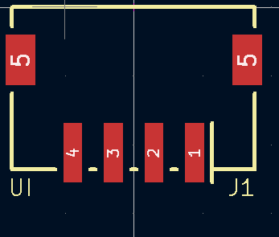
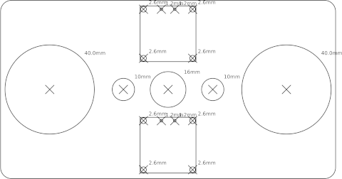

# Ritning

Ritning is a small Python helper library for creating technical graphics by scripting them.
The graphics can be:

* SMD/THT component footprints for KiCad
* Paper stencils to mark drillings on housings or acrylic plates (SVG)
* Graphics for laser cutting

The output format can be SVG or "kicad_mod"

Example outputs:

   -   

[See examples in cheetsheet.md](doc/cheetsheet.md)
