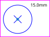

# Cheet-Sheet

The rectangle in magenta is only a border box. THe blue dot marks the zero coordinates and will not be part of used function.

`circle(x, y, diameter)`:  
>

`quadCircle(x, y, distX, distY, diameter)`:  
>

`r.rect(x, y, width, height)`:  
>

`r.rectParam="rx=\"5mm\""`  
`r.rect(x, y, width, height)`:  
>

`r.text(x, y, "Hello World!")`:  
>

`r.line(x1, y1, x2, x2)`:  
>

`r.infoBox(x1, y1, textArray)`:  
>

